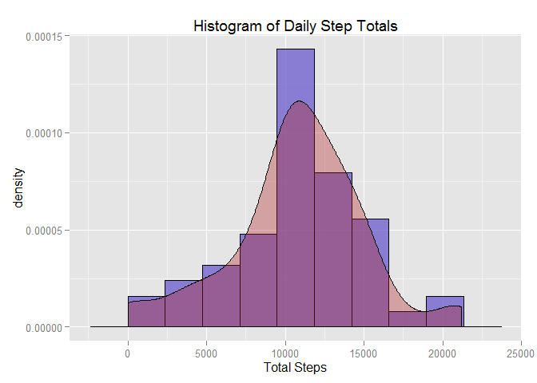
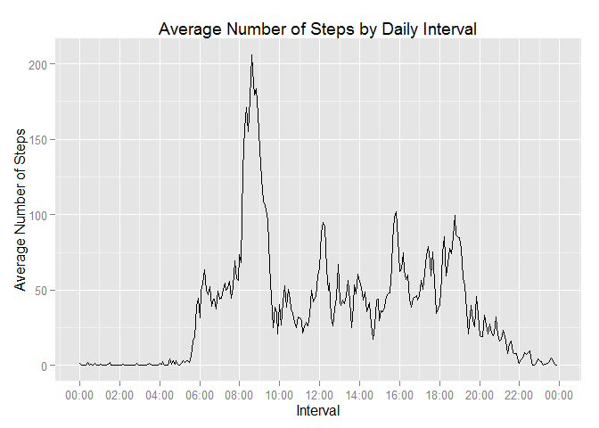
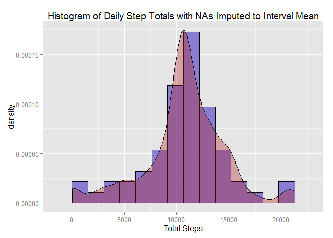
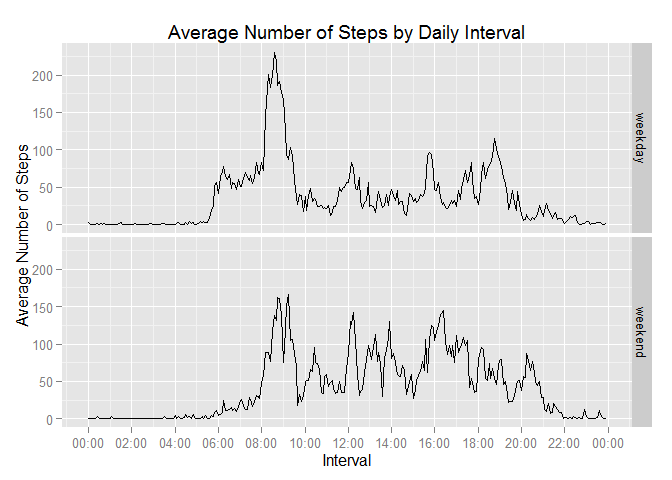

# Reproducible Research: Peer Assessment 1


## Loading and preprocessing the data
1. To begin, we load the dataset in the file "activity.csv" using the `read.csv()` command.
Depending on the user's preference, the working directory may contain this file or
its parent folder which could be called "activity.zip" or just "activity" depending
upon how it was extracted. We can check for any of these situations using `if` and `else`
statements and process accordingly. Since the GitHub repository for this assignment
contains the zipped data we shouldn't need to look anywhere else.


```r
if (exists("rawData")) {
    print("Raw activity data already loaded.")
} else if (file.exists("activity.csv")) {
    print("Found file 'activity.csv'. Reading in data.")
    rawData <- read.csv("activity.csv", header = TRUE)
} else if (file.exists("activity")) {
    print("Found 'activity' folder. Reading in data.")
    rawData <- read.csv("./activity/activity.csv", header = TRUE)
} else if (file.exists("activity.zip")) {
    print("Found 'activity.zip' folder. Extracting and reading in data.")
    unzip("./activity.zip")
    rawData <- read.csv("activity.csv", header = TRUE)
} else {
    stop("Unable to locate data file or folder. Exiting program.")
}
```

```
## [1] "Found file 'activity.csv'. Reading in data."
```

2. Next we will copy the raw data set over to the `activityData` data frame and discard of the original raw data. We also transform the `date` column to type `POSIXct` to make working with it easier. Finally, in order to avoid strange gaps in the intervals, which are meant to represent five minute time periods, we will convert them from integers to datetime objects. To do so we use the `sprintf()` function to format all the intervals as a 4 digit integer and then use `strptime()` to convert the result to a datetime class. This can be converted explicitly to type POSIXct using the `as.POSIXct()` function.


```r
activityData <- rawData
activityData$date <- as.POSIXct(strptime(rawData$date, "%Y-%m-%d"))
intervalTime <- strptime(sprintf("%04d", activityData$interval), "%H%M")
activityData$intervalTime <- as.POSIXct(intervalTime, format = "%H:%M")
rm('rawData')
rm('intervalTime')
```

## What is mean total number of steps taken per day?
1. To calculate the total number of steps taken per day we use `dplyr` to group
the data frame by date and then sum the number of steps for each date using the
`group_by()` and `summarise()` statements in chained succession. The result of
these operations is saved in a data frame called `dailyStepTotals`. Furthermore, in order to avoid skewing the histogram toward zero, a result of using `na.rm = TRUE` in the `sum()` function, we will compute the daily step totals without removing the `NAs` and then remove those rows afterwards. One issue with this could be that we would then skew the histogram by removing too many days from the summary. Since the summary is being performed on a data frame grouped by date, if there are many days with missing values then there will be many days without sums computed. This turns out not to be the case and in fact the only days on which there are missing values appear to consist entirely of missing values. I will verify this claim a bit later when we investigate the missing values further.


```r
require(dplyr)
```

```
## Loading required package: dplyr
## 
## Attaching package: 'dplyr'
## 
## The following object is masked from 'package:stats':
## 
##     filter
## 
## The following objects are masked from 'package:base':
## 
##     intersect, setdiff, setequal, union
```

```r
dailyStepTotals <- group_by(activityData, date) %>%
    summarise(totalSteps = sum(steps))
dailyStepTotals <- dailyStepTotals[which(!is.na(dailyStepTotals$totalSteps)), ]
```

2. We can then view a histogram of the total number of steps by day using `ggplot2`. Here we make use of the [Freedman-Diaconis](http://en.wikipedia.org/wiki/Freedman%E2%80%93Diaconis_rule) rule to determine the proper bin width and overlay the histogram with a smoothed kernel density estimate.


```r
require(ggplot2)
```

```
## Loading required package: ggplot2
```

```r
bw <- 2 * IQR(dailyStepTotals$totalSteps) / length(dailyStepTotals$totalSteps)^(1/3)

h <- {ggplot(dailyStepTotals, aes(x = totalSteps)) +
          geom_histogram(aes(y=..density..), binwidth = bw, color = 'black', 
                         fill = 'slateblue', alpha = .75) +
          geom_density(alpha=.35, fill="firebrick") +
          xlab("Total Steps") +
          ggtitle("Histogram of Daily Step Totals")
}
print(h)
```

 

3. Since we saved the tabulated total steps for each day in a column in the 
`dailyStepTotals` data frame it is straightfoward to determine the mean and median.


```r
mean(dailyStepTotals$totalSteps)
```

```
## [1] 10766.19
```

```r
median(dailyStepTotals$totalSteps)
```

```
## [1] 10765
```

## What is the average daily activity pattern?
1. To determine the average number of steps taken per 5-minute interval we can
use a similar series of `dplyr` statements as above. We save this result in a
data frame called `intervalMeans`. In this case we must remove the missing values by explicitly setting `na.rm = TRUE` when taking the mean because all of the intervals contain a missing value on at least one day.


```r
intervalMeans <- group_by(activityData, intervalTime) %>%
    summarise(intMean = mean(steps, na.rm = TRUE))
```

We can then produce a time series plot using `ggplot2` and `geom_line()`. We also make use of the `scales` package and the `scale_x_datetime()` function to properly display the time intervals on the x-axis.


```r
require(scales)
```

```
## Loading required package: scales
```

```r
t <- {ggplot(intervalMeans, aes(x = intervalTime, y = intMean)) + 
          geom_line() +
          scale_x_datetime(breaks = date_breaks("2 hours"),
                           labels = date_format("%H:%M")) +
          xlab("Interval") +
          ylab("Average Number of Steps") +
          ggtitle("Average Number of Steps by Daily Interval")
}
print(t)
```

 

2. The time series plot shows a clear spike in average number of steps taken
around 08:00 or 09:00 AM. We can determine which daily interval has, on average, the maximum number of steps and identify this spike. Here we again make use of the `dplyr` package with the `filter()` and `select()` function to choose the row whose interval mean matches the maximum and the interval time column for that row, respectively. Note: the date shown here with the time interval is arbitrary. When converting the time intervals to `POSIXct` it chooses a date, defaulting to the current date when this statement is executed, since one is not given. For our purposes it is not a problem that all the time intervals, regardless of the actual date of the observation, are shown to have the same date.


```r
filter(intervalMeans, intMean == max(intMean)) %>% select(intervalTime)
```

```
## Source: local data frame [1 x 1]
## 
##          intervalTime
## 1 2015-03-15 08:35:00
```

## Imputing missing values
Next we wish to examine the effect of missing values, i.e. `NAs`, on the results
obtained so far and to work out a method for replacing them with real values, or imputing them.


1. First, we need to get an idea for the extent of missing values in the data set. In addition to reporting the total number of rows with missing values we report the unique dates upon which missing values occur.


```r
length(which(is.na(activityData$steps)))
```

```
## [1] 2304
```

```r
unique(activityData[which(is.na(activityData$steps)), ]$date)
```

```
## [1] "2012-10-01 EDT" "2012-10-08 EDT" "2012-11-01 EDT" "2012-11-04 EDT"
## [5] "2012-11-09 EST" "2012-11-10 EST" "2012-11-14 EST" "2012-11-30 EST"
```

I claimed earlier that removing the dates with missing values when taking the daily sums was justified because they appeared to be completely missing. Here we see that there are 8 unique dates with missing values. Dividing the total number of rows with missing values, 2304, by the number of 5-minute time intervals in a day, 288, gives 8, the exact number of days with missing values we found.

2. With `NAs` in 13 percent of the rows in the data set it is important to find a way to fill in these values with someting meaningful. I chose to do so using the mean number of steps for that interval. This method assumes the missing values occur randomly in the data set and using the mean value for a given daily time interval on a date in which they happen to be missing will serve as a reasonable estimate for what the measured value might have been. However, one could imagine a situation in which this would not be an applicable method if, for example, the monitor was not worn during a particular time interval each day. In this case, then, a more appropriate method might be to impute all missing values with zeros.


3. With this strategy in mind we go about imputing the missing values. First we will make a copy of the data set and make a list of the the rows with missing values in them.


```r
imputedActivityData <- activityData
naRows = which(is.na(imputedActivityData$steps))
```

Then we can fill in the missing values with the mean number of steps for that interval taken from the `intervalMeans` data frame created earlier. We do so by looping through the rows in the copied data frame with missing values and assigning to the `steps` column the appropriate interval mean.


```r
for (i in seq_along(naRows)) {
    imputedActivityData[naRows[i], 'steps'] =
        intervalMeans[intervalMeans$intervalTime ==
                          imputedActivityData[naRows[i], 'intervalTime'],
                      'intMean']
}
```

4. We can then make a histogram of the total number of steps taken per day for the imputed data set much as we did for the original data set.


```r
imputedDailyStepTotals <- group_by(imputedActivityData, date) %>% 
    summarise(totalSteps = sum(steps))

bwI <- 2 * IQR(imputedDailyStepTotals$totalSteps) / length(imputedDailyStepTotals$totalSteps)^(1/3)

hI <- {ggplot(imputedDailyStepTotals, aes(x = totalSteps)) +
          geom_histogram(aes(y=..density..), binwidth = bwI, color = 'black', 
                         fill = 'slateblue', alpha = .75) +
          geom_density(alpha=.35, fill="firebrick") +
          xlab("Total Steps") +
          ggtitle("Histogram of Daily Step Totals with NAs Imputed to Interval Mean")
}

print(hI)
```

 

We can also report the `mean()` and `median()` using the newly created `imputedDailyStepTotals` data frame.


```r
mean(imputedDailyStepTotals$totalSteps)
```

```
## [1] 10766.19
```

```r
median(imputedDailyStepTotals$totalSteps)
```

```
## [1] 10766.19
```

There are two noticeable effects that result from imputing the missing values in this data set as we have. The first is that the median increased slightly but the mean stayed exactly the same. This is not surprising since we replaced all the missing values with the mean for the corresponding 5-minute interval. The second effect is that the distribution of values is narrower than before. This can be seen both in the histogram and in the fact that the imputed mean and median are equal for the imputed data set.

## Are there differences in activity patterns between weekdays and weekends?
1. To answer this final question we must first create a factor variable in the imputed data set which indicates if a particular date is a weekday or weekend day. We can first create a list of all rows which have a date that falls on a Saturday or Sunday as follows.

```r
weekendRows <- which(weekdays(imputedActivityData$date) %in%
                         c("Saturday", "Sunday"))
```
Then we add a column to the data set using `mutate()` for the type of day. This is done in two steps: 1) add the factor variable with all values set to "weekday" and 2) subset the data frame on the weekend rows and set those to "weekend."

```r
imputedActivityData <- mutate(imputedActivityData, 
                              dayType = factor(x = "weekday", 
                                               levels = c("weekday", "weekend")))
imputedActivityData[weekendRows, 'dayType'] <- factor(x = "weekend",
                                                      levels = c("weekday", "weekend"))
```

2. Finally, we create a panel plot comparing weekday and weekend activity levels, i.e. average number of steps taken, for each 5-minute interval to assess any differences in activity patterns between these two groups. 

```r
imputedIntervalMeans <- group_by(imputedActivityData, dayType, intervalTime) %>% 
    summarise(intMean = mean(steps))
tI <- {ggplot(imputedIntervalMeans, aes(x = intervalTime, y = intMean)) + 
          geom_line() + 
          scale_x_datetime(breaks = date_breaks("2 hours"), labels = date_format("%H:%M")) +
          facet_grid(dayType ~ .) +
          xlab("Interval") +
          ylab("Average Number of Steps") +
          ggtitle("Average Number of Steps by Daily Interval")
}
print(tI)
```

 
